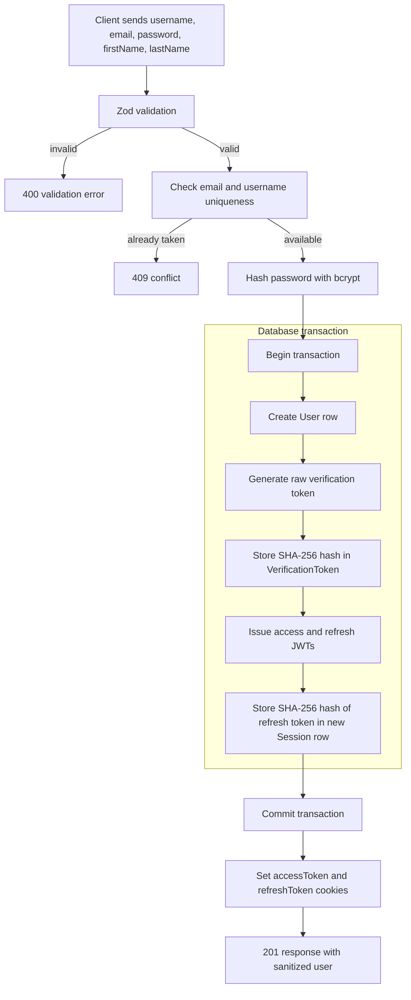
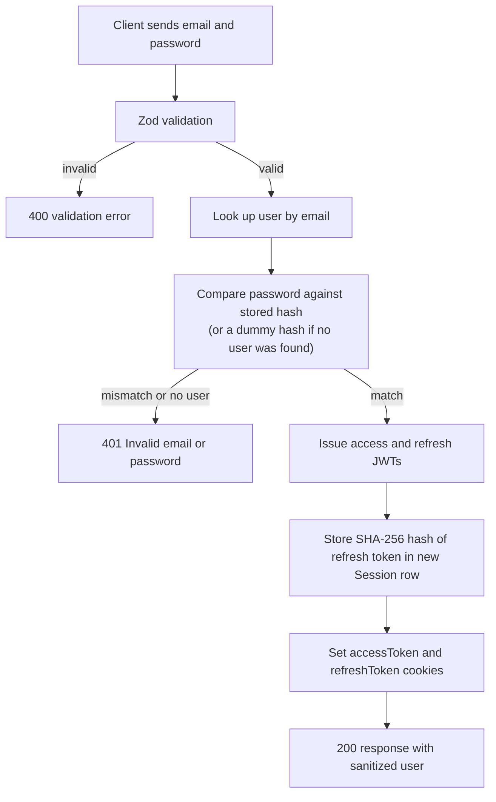
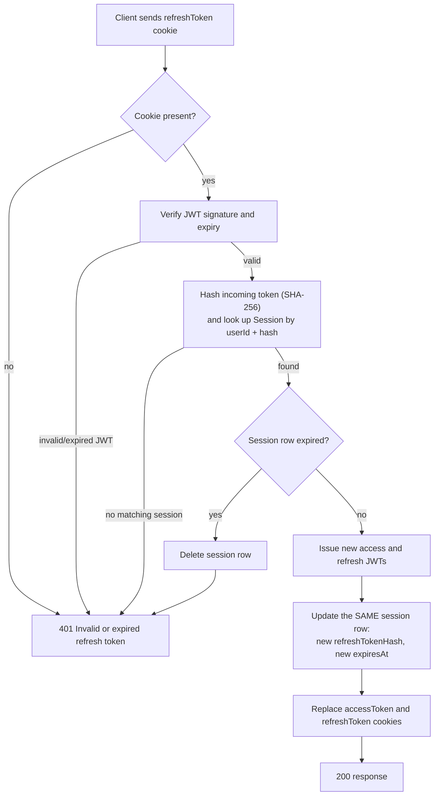
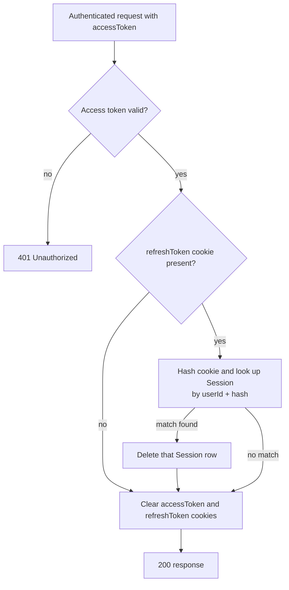
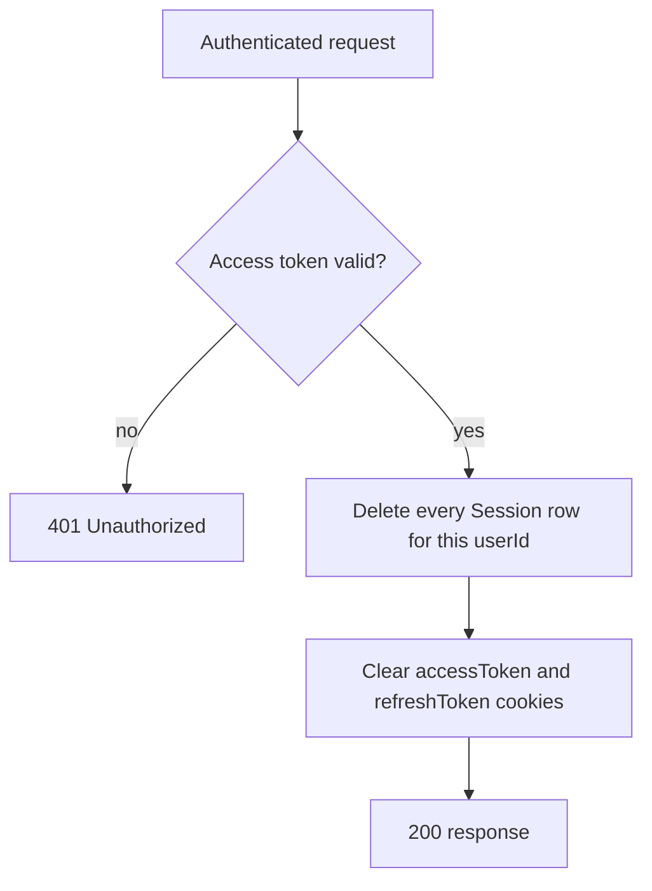
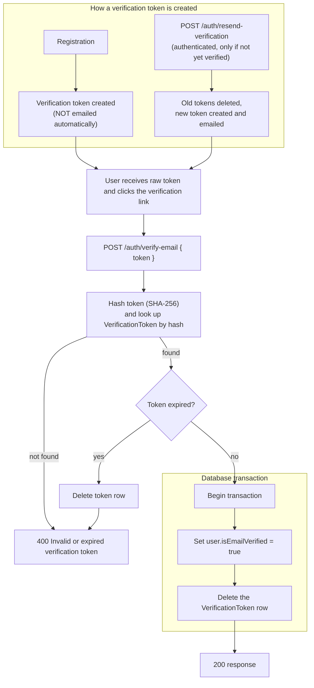
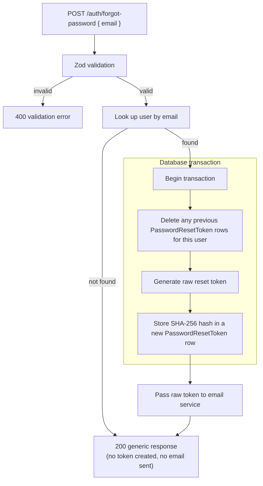
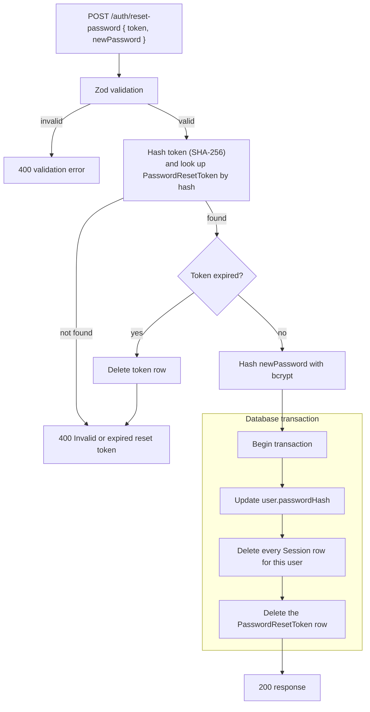
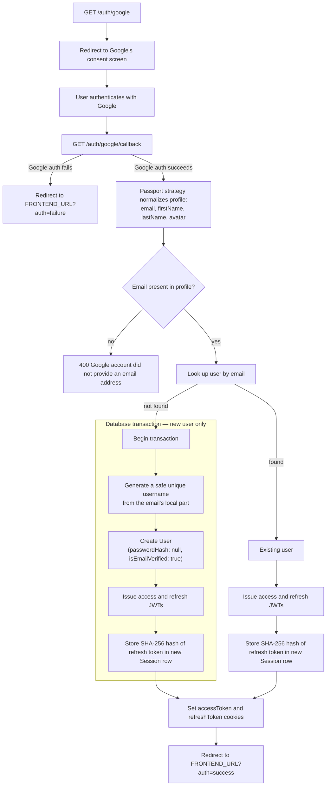

# Authentication Flows

This document explains how authentication and session management actually work in the User Service, flow by flow, as implemented in `src/services/auth.service.js`, `src/controllers/auth.controller.js`, `src/config/passport.js`, and the supporting repositories/utilities.

Where a step involves a database write, the diagrams note whether it happens inside a Prisma transaction.

**Flows**

1. [Registration](#1-registration-flow)
2. [Login](#2-login-flow)
3. [Refresh Token Rotation](#3-refresh-token-rotation)
4. [Logout](#4-logout)
5. [Logout All](#5-logout-all)
6. [Email Verification](#6-email-verification)
7. [Forgot Password](#7-forgot-password)
8. [Reset Password](#8-reset-password)
9. [Google OAuth](#9-google-oauth)

---

## 1. Registration Flow

### Explanation

The request body is validated with `registerSchema` (username, email, password, first name, last name) before anything touches the database. The service then checks that both the email and username are free; if either is taken, registration fails with `409`.

**Transactions.** User creation, verification token creation, and the initial session creation all happen inside a single `prisma.$transaction`. If any step fails — including a race where two requests register the same email/username at the same moment — nothing is left half-created. A concurrent duplicate is caught via the database's unique constraint (Prisma error `P2002`) and converted into the same `409` response the pre-check would have produced.

**Token handling.** Two independent tokens are generated here: a raw email-verification token and a JWT refresh token. Both are hashed before storage — the verification token with SHA-256, the refresh token also with SHA-256 (see [Refresh Token Rotation](#3-refresh-token-rotation) for why SHA-256 rather than bcrypt is used for tokens). The raw verification token is kept only in memory for the duration of the request and is not included in the API response; it exists so a future call to `/auth/resend-verification` can reuse it without regenerating one. **Registration itself does not send a verification email** — no email is dispatched until `/auth/resend-verification` is called.

**Session handling.** A `Session` row is created for the new account, capturing the hashed refresh token, the client's IP address and user agent, and an expiry matching `JWT_REFRESH_EXPIRES`.

**Security considerations.** The password is hashed with bcrypt before it is ever written to the database; the plaintext password never appears outside the request handler. The response is passed through `sanitizeUser`, which excludes `passwordHash` (and, being the account owner's own view, includes `email`/`role`/`isEmailVerified`).

---

## 2. Login Flow

### Explanation

Credentials are validated with `loginSchema`, then the user is looked up by email and the supplied password is checked against the stored bcrypt hash.

**Security considerations.** If no user matches the email, the password is still compared against a hardcoded dummy bcrypt hash rather than skipping the comparison — this keeps the response time for "no such user" and "wrong password" statistically similar, so the endpoint cannot be used to enumerate which emails are registered. Both failure cases return the identical `401 Invalid email or password`.

**Transactions.** None — login performs a single write (creating the new session), so no transaction is needed.

**Token handling.** A fresh access/refresh JWT pair is issued on every successful login. The refresh token is hashed with SHA-256 before storage; the raw value only ever leaves the server as an httpOnly cookie.

**Session handling.** A new `Session` row is created for this login. Existing sessions from other devices or browsers are left untouched — a user can be logged in from multiple places simultaneously (see [Session Management](API.md#sessions) for how those are listed and revoked).

---

## 3. Refresh Token Rotation

### Explanation

The refresh token is read from the `refreshToken` cookie (there is no request body). It must be a validly signed, unexpired JWT, and its SHA-256 hash must match a `Session` row belonging to the same user. Any failure along this path — missing cookie, invalid signature, no matching session, or an expired session — returns the same `401 Invalid or expired refresh token`, so a caller cannot distinguish between these cases.

**Token handling — rotation.** This is a single-use refresh token design: once a refresh token is used successfully, the session's stored hash is immediately overwritten with the hash of the newly issued refresh token. The old refresh token no longer matches any session, so replaying it fails. Refresh tokens (like verification and reset tokens) are hashed with SHA-256, not bcrypt — bcrypt truncates its input at 72 bytes, and JWTs routinely exceed that length, which would cause distinct tokens for the same user to be treated as equal. SHA-256 has no such truncation.

**Session handling.** Rotation **updates the existing session row in place** — it does not delete the session and create a new one. The same session `id` persists across rotations; only its `refreshTokenHash` and `expiresAt` change (and `ipAddress`/`userAgent` are refreshed if provided). This means a session's identity is stable for as long as it remains active, which is what allows `/sessions` and `DELETE /sessions/:id` to target "the same session" across multiple refreshes.

**Transactions.** None — the session lookup and the session update are separate statements. There is no multi-table write here that requires atomicity.

**Security considerations.** If the matched session's `expiresAt` has already passed, the row is deleted before the rejection is returned, so an expired session cannot be revived by a later valid-looking request.

---

## 4. Logout

### Explanation

Logout first authenticates the caller via the standard `authenticate` middleware (access token, from either the `Authorization` header or the `accessToken` cookie). It then uses the `refreshToken` cookie to identify which specific session the caller is currently using, by the same SHA-256 hash-matching used during refresh, scoped to the authenticated user's own sessions.

**Session handling.** Only the one session that matches the current refresh token is deleted. All of the user's other sessions (other devices/browsers) are left active.

**Security considerations.** This endpoint is deliberately idempotent: if the `refreshToken` cookie is missing or doesn't match any session, logout still succeeds and still clears the cookies — it never errors just because the session was already gone.

**Transactions.** None — a single delete operation.

---

## 5. Logout All

### Explanation

Unlike single-session logout, this endpoint does not need the refresh token at all — it deletes every `Session` row belonging to the authenticated user's id, including the session the request itself is using.

**Session handling.** Every device/browser the user was logged into is signed out; each of those sessions' refresh tokens becomes invalid immediately, since their rows no longer exist for the refresh lookup to match against.

**Transactions.** None — a single bulk delete.

**Security considerations.** This is the same "revoke everything" mechanism reused by [Reset Password](#8-reset-password) to force a full logout after a password change.

---

## 6. Email Verification

### Explanation

A verification token can enter the system two ways: registration creates one automatically (but does not email it), and `/auth/resend-verification` creates a fresh one and does email it (via `email.service.js`, which currently logs the payload to the console rather than calling a real provider — see the README). Either way, verifying it is the same operation: `POST /auth/verify-email` hashes the submitted token with SHA-256 and looks up a `VerificationToken` row by that hash.

**Token handling.** The raw token is never stored — only its SHA-256 hash is. If the matched token's `expiresAt` has passed, the row is deleted and the same generic `400 Invalid or expired verification token` is returned as when no token matches at all, so an expired token and a nonexistent one are indistinguishable to the caller.

**Transactions.** Marking the user verified and deleting the token happen together in one transaction, so a token cannot be left usable after the account has already been marked verified (or vice versa).

**Security considerations.** Because the token is deleted as part of the same transaction that verifies the email, each verification token is single-use — resubmitting it after a successful verification fails with the same `400` used for any other invalid token.

---

## 7. Forgot Password

### Explanation

This endpoint always returns the same `200` response with the same message, whether or not the submitted email belongs to a real account — the only observable difference between "account exists" and "account doesn't exist" is whether a token was created and an email logged internally, neither of which is visible to the caller. This is a deliberate anti-enumeration measure.

**Transactions.** When the account exists, deleting old reset tokens and creating the new one happen inside one transaction, so a user can never end up with more than one valid reset token — any link sent earlier stops working the moment a new one is requested.

**Token handling.** The raw reset token is generated with the same cryptographically random generator used for verification tokens, and only its SHA-256 hash is persisted. The raw token is handed to `email.service.js`'s `sendPasswordResetEmail`, which — like the verification email — currently logs the payload to the console instead of integrating a real provider.

**Session handling.** Not applicable at this stage; sessions are only affected once the reset is actually completed (see below).

---

## 8. Reset Password

### Explanation

Resetting a password follows the same lookup pattern as email verification: the submitted token is hashed with SHA-256 and matched against a `PasswordResetToken` row. An unrecognized or expired token both produce the same `400 Invalid or expired reset token`.

**Transactions.** Updating the password, deleting all of the user's sessions, and deleting the reset token all happen in a single transaction. This is the most consequential transaction in the service: it guarantees that a password can never be changed without also revoking every existing session, and that the reset token can never be reused.

**Session handling.** Every session belonging to the user is deleted — the same mechanism as [Logout All](#5-logout-all). Any device that was previously logged in is signed out and must authenticate again with the new password.

**Security considerations.** Forcing a full session wipe on password reset is what prevents a scenario where an attacker who had stolen a session (but not the password) stays logged in after the legitimate user resets their password to recover the account.

---

## 9. Google OAuth

### Explanation

`GET /auth/google` redirects the browser to Google's OAuth consent screen using Passport's Google strategy in stateless mode (`session: false` — no server-side OAuth session is kept). Once the user authenticates with Google, Google redirects back to `GET /auth/google/callback`.

The Passport strategy's verify callback does no database work at all — it only normalizes the Google profile into `{ email, firstName, lastName, avatar }`. All account logic happens afterward in `authService.loginWithGoogle`, keeping the OAuth wiring and the business logic separate.

**Email is the sole identity key.** There is no separate "Google account id" stored anywhere. If the email from Google matches an existing user — however that account was originally created — that user is simply logged in. This means a user who registered with a password can later sign in with Google (or the reverse) without ever ending up with two accounts, as long as the email matches.

**New user creation.** If no user matches, one is created with `passwordHash: null` (there is no password to verify against for an OAuth-only account) and `isEmailVerified: true` (Google has already verified the email on its side). A username is derived from the local part of the email address, sanitized down to letters, numbers, and underscores; if that username is already taken, a random suffix is appended, retried a bounded number of times, with a fully random fallback username if every attempt collides.

**Transactions.** For a new user, username generation, user creation, and the initial session creation all happen inside one transaction. If two simultaneous requests would create the same new account (a race on the same email), the resulting unique-constraint violation is caught and the flow falls back to treating it as a login for the account that was created by the other request, rather than surfacing an error.

**Session and token handling.** Whether the user is new or existing, the outcome is the same as [Login](#2-login-flow): a fresh access/refresh JWT pair is issued, a new `Session` row is created with the refresh token's SHA-256 hash, and both tokens are set as httpOnly cookies.

**Security considerations.** A failure inside Passport's own Google authentication (e.g. the user denies consent) results in a redirect to `<FRONTEND_URL>?auth=failure`, configured as Passport's `failureRedirect`. A failure that happens *after* Google authentication succeeds — specifically, a Google profile with no email — is raised as an application-level `400` JSON error instead of a redirect, since by that point the request is being handled by this service's own controller rather than Passport.
